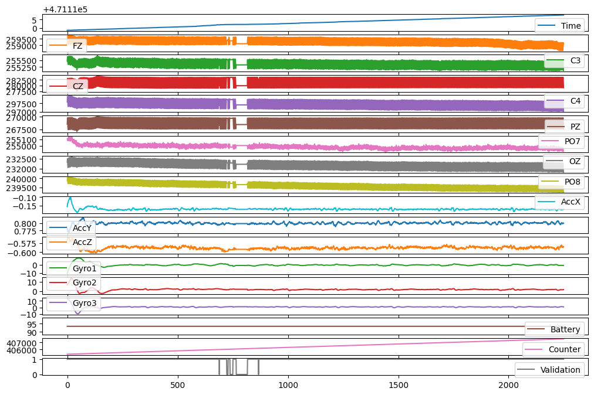

# Brain-Computer Interface: EEG Signal Classification 🧠⚡️


This repository contains the complete solution for the **MTCAIC3 Kaggle competition**, focusing on the classification of EEG brain signals for two distinct Brain-Computer Interface (BCI) tasks: **Motor Imagery (MI)** and **Steady-State Visually Evoked Potentials (SSVEP)**.

**➡️ For the full code and step-by-step analysis, please see the [Full Notebook here](https://github.com/Jasmine25005/BCI-EEG-Signal-Classification-Competition-Solution/blob/main/mtcaic3-solution-high-accuracy-bci-with-csp-cca.ipynb).**

---

## 🗺️ Overall Strategy

The MI and SSVEP tasks require different signal processing techniques. This solution implements two independent, specialized pipelines to maximize performance for each task:

* **Motor Imagery (MI) Pipeline:**
    > **Bandpass Filter → Common Spatial Patterns (CSP) → Linear Discriminant Analysis (LDA).**

* **SSVEP Pipeline:**
    > **Bandpass Filter → Canonical Correlation Analysis (CCA).**

A `StratifiedGroupKFold` cross-validation strategy was used to ensure the models generalize well across different subjects.

---

## 🔬 Methodology Highlights

### Signal Preprocessing
A key first step was applying a **bandpass filter** to the raw EEG data to isolate relevant neural frequencies and remove noise. Different frequency bands were used for each task to align with their unique neural signatures.
<p align='center'>

</p>

### Classification Models
* **For Motor Imagery (MI):** We used **Common Spatial Patterns (CSP)**, a powerful algorithm for EEG feature extraction, combined with a **Linear Discriminant Analysis (LDA)** classifier.
* **For SSVEP:** We used **Canonical Correlation Analysis (CCA)**, the state-of-the-art method which classifies signals by finding the highest correlation with reference frequencies.

---

# 🏆 Results & Competition Standing
## The final solution performed strongly on the private leaderboard, placing in the top 40% of all competing teams. This result was achieved by developing specialized pipelines for each BCI task.

### Final Rank: `84 / 215` Teams 🏅

* **Final Combined Competition Score: `0.56764`**

**The final score is a combination of the model performance on each task, evaluated using the macro F1-score:**

* **Max Motor Imagery (MI) F1-Score: `0.55`**

* **Max SSVEP F1-Score: `0.6023`**
---

## 🛠️ Tech Stack

* **Core Libraries:** `Python`, `pandas`, `numpy`
* **Signal Processing & ML:** `scikit-learn`, `MNE-Python`, `scipy`
* **Data Visualization:** `matplotlib`
* **Parallel Processing:** `joblib`

---

## 🚀 How to Run

1.  **Clone the repository:**
    ```sh
    git clone https://github.com/Jasmine25005/BCI-EEG-Signal-Classification-Competition-Solution.git
    cd BCI-EEG-Signal-Classification-Competition-Solution
    ```
2.  **Install dependencies:**
    ```sh
    pip install pandas numpy scikit-learn mne scipy joblib matplotlib
    ```
3.  **Explore the analysis:**
    For a detailed walkthrough of the code, data processing, and results, please open the **[Full Notebook](https://github.com/Jasmine25005/BCI-EEG-Signal-Classification-Competition-Solution/blob/main/mtcaic3-solution-high-accuracy-bci-with-csp-cca.ipynb)**.
